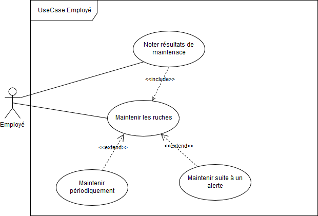
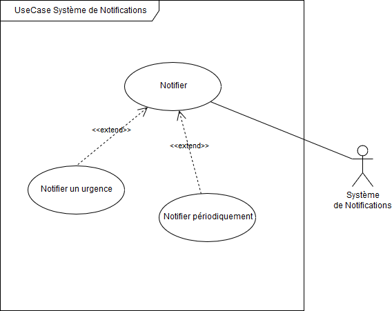

# Les diagrammes des Cas d'Utilisation
This a detailed description of the UseCase diagrams.

- [Les diagrammes des Cas d'Utilisation](#les-diagrammes-des-cas-dutilisation)
- [Description des Acteurs du Système](#description-des-acteurs-du-syst%C3%A8me)
- [Description des Cas d'Utilisation](#description-des-cas-dutilisation)
  - [Cas d'Utilisation Exploitant](#cas-dutilisation-exploitant)
  - [Cas d'Utilisation Employee](#cas-dutilisation-employee)
  - [Cas d'Utilisation Employee](#cas-dutilisation-employee-1)

# Description des Acteurs du Système
- **Exploitant**: une petite description de l'acteur "Exploitant"
- **Employee**: une petite description de l'acteur "Employé"
- **Systeme de Notification**: une petite description de l'acteur "Système de Notification"

# Description des Cas d'Utilisation
Dans cette partie on va identifier les cas d'utlisations 

## Cas d'Utilisation Exploitant

## Cas d'Utilisation Employee

## Cas d'Utilisation Employee

