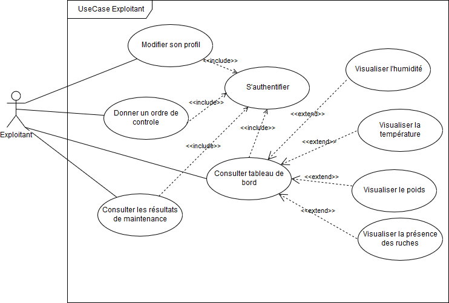

# UseCase diagrams
This a detailed description of the UseCase diagrams.

## Actors description
### Exploitant
### Employee
### Systeme de Notification

## UseCase Description
### UseCase Exploitant
The following diagram represents the UseCase diagram of Exploitant actor

### Description
This a detailed description of the UseCase diagrams.
