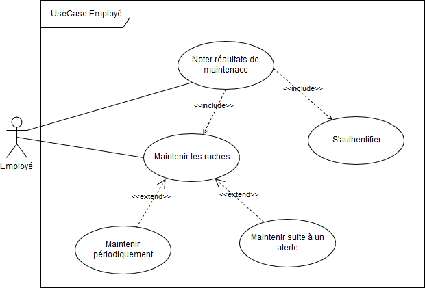

# Les Cas d'Utilisation
On va identifier la liste des cas d'utlistations de notre système.

- [Les Cas d'Utilisation](#les-cas-dutilisation)
- [Description des Acteurs du Système](#description-des-acteurs-du-syst%C3%A8me)
- [Description des Cas d'Utilisation](#description-des-cas-dutilisation)
  - [Cas d'Utilisation Exploitant](#cas-dutilisation-exploitant)
  - [Cas d'Utilisation Employé](#cas-dutilisation-employ%C3%A9)
  - [Cas d'Utilisation Système de Notifications](#cas-dutilisation-syst%C3%A8me-de-notifications)

# Description des Acteurs du Système
- **Exploitant**: une petite description de l'acteur "Exploitant"
- **Employe**: une petite description de l'acteur "Employé"
- **Systeme de Notification**: une petite description de l'acteur "Système de Notification"

# Description des Cas d'Utilisation
Dans cette partie on va identifier les cas d'utlisations.

## Cas d'Utilisation Exploitant

Cas d'utlisation de l'acteur Exploitant.

## Cas d'Utilisation Employé

Cas d'utlisation de l'acteur Employé.

## Cas d'Utilisation Système de Notifications

Cas d'utlisation de l'acteur Système de Notifications.

